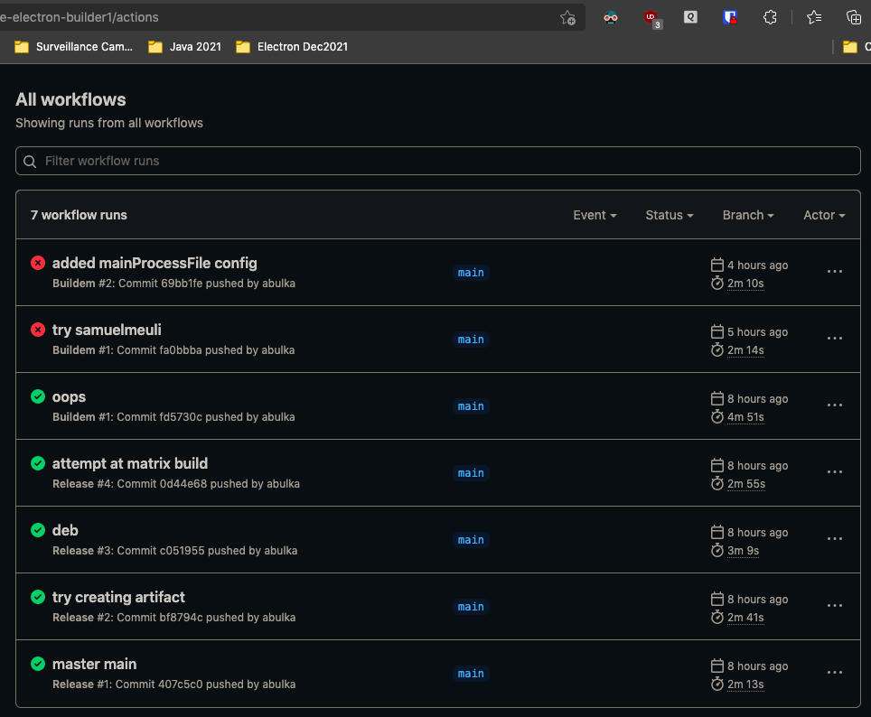

# vue-electron-builder1

Electron Vue project built using official steps - works as website and electron app. Deploy to all architectures incl. heroku. Raspberry Pi .deb is a problem however

Also contains Vuetify UI components.

Deployed to Heroku https://vue-electron-builder1.herokuapp.com/#/

## Project setup
```
yarn install
```

### Compiles and hot-reloads for development
```
yarn serve
```

### Compiles and minifies for production
```
yarn build
```

### Lints and fixes files
```
yarn lint
```

### Customize configuration
See [Configuration Reference](https://cli.vuejs.org/config/).

# ANDY NOTES

built with the steps

    nvm use 16
    npm ls -g
    npm uninstall -g vue-cli
    npm install -g @vue/cli

Creating a Project (standard vue)
https://cli.vuejs.org/guide/creating-a-project.html#vue-create

    vue create hello-world
    cd vue-electron-builder1
    yarn serve

To manage ALL your vue projects

    vue ui

## Vue CLI Plugin Electron Builder
https://nklayman.github.io/vue-cli-plugin-electron-builder/guide/#installation
Within the project dir

    vue add electron-builder
    yarn electron:serve

yes can edit and its all hot reloaded

### to build deployables

    yarn electron:build

for all platforms - works on a mac!

    yarn electron:build --linux deb --win nsis

## Interesting Observations

- Running yarn serve seems independent of vue ui serve
- The vue ui server displays tasks for electron build, serve as well as normal build, serve - which is nice

## Raspberry Pi

vue.config.js 

```js
module.exports = {
  transpileDependencies: [
    'vuetify'
  ],
  pluginOptions: {
    electronBuilder: {
      builderOptions: {
        // options placed here will be merged with default configuration and passed to electron-builder
        linux: {
          category: "Education",
          target: [
            {
              target: "deb",
              arch: [
                "armv7l"
              ]
            }
          ]
        },
        deb: {
          fpm: ["--architecture", "armhf"]
        }
      }
    }
  }
}
```

    vue-cli-service electron:build --linux

or just

    yarn electron:build --linux

built but doesn't install.

See Mac Notes 'electron' for more.

# Workflows



## Github Actions Summary

must use `use_vue_cli: true` in your github workflow yml

    - name: Build/release Electron app
      uses: samuelmeuli/action-electron-builder@v1
      with:
        github_token: ${{ secrets.github_token }}
        use_vue_cli: true       <-------- 
        release: ${{ startsWith(github.ref, 'refs/tags/v') }}

See my project /Users/Andy/Devel/electron-dec-2021/vue-electron-builder1/.github/workflows/buildem.yml

### Note:

Hopefully this solves all my problems!  Yes it does. 🎉  See https://github.com/samuelmeuli/action-electron-builder/issues/66
It causes this invocation

    $ /Users/runner/work/vue-electron-builder1/vue-electron-builder1/node_modules/.bin/vue-cli-service electron:build --mac

instead of the problematic

    $ /Users/runner/work/vue-electron-builder1/vue-electron-builder1/node_modules/.bin/electron-builder --mac

which in retrospect makes sense since we are using VUE with electron, not using plain electron.  
Cos this `samuelmeuli/action-electron-builder@v1` plugin is all about ELECTRON, not specifically VUE.  Though it is nice 
enough to give us this special VUE option.

    use_vue_cli: true

# My post re the `use_vue_cli: true` solution

https://github.com/nklayman/vue-cli-plugin-electron-builder/issues/188

You may be getting all the errors mentioned in this issue when building your Vue based Electron app using **GitHub Actions** using the famous https://github.com/samuelmeuli/action-electron-builder GitHub Actions plugin. Thus your googling may lead you here. The errors are:

- `...resources/app.asar" does not exist. Seems like a wrong configuration.` error 
- `dist/` vs `dist_electron/` problems
- package.json problems re `"main": "background.js",` vs `"main": "src/background.js",`
- `vue.config.js` problems re `mainProcessFile: 'src/background.js',` and `files: ['dist_electron/**/*'],` etc.

As https://github.com/samuelmeuli/action-electron-builder/issues/66 says, you simply need to add `use_vue_cli: true` to your Github Actions workflow `yml` file. Keep your package.json containing the default `"main": "background.js"`, and you don't need to do anything to `vue.config.js`. 

```yml
- name: Build/release Electron app
  uses: samuelmeuli/action-electron-builder@v1
  with:
    github_token: ${{ secrets.github_token }}
    use_vue_cli: true       # <-------- you need this
    release: ${{ startsWith(github.ref, 'refs/tags/v') }}
```

### Detail

In a Github Actions workflow `yml` file, specifying the `use_vue_cli: true` option to the [samuelmeuli/action-electron-builder@v1](https://github.com/samuelmeuli/action-electron-builder) causes this good invocation e.g.:

    $ /Users/runner/work/vue-electron-builder1/vue-electron-builder1/node_modules/.bin/vue-cli-service electron:build --mac

instead of the problematic, plain electron-builder invocation, which builds in the `dist/` directory instead of `dist_electron/`

    $ /Users/runner/work/vue-electron-builder1/vue-electron-builder1/node_modules/.bin/electron-builder --mac

Look in your Github Action build logs to see which command is being invoked. 

We want Vue with Electron via the Vue plugin [vue-cli-plugin-electron-builder](https://github.com/nklayman/vue-cli-plugin-electron-builder), not just plain Electron without Vue.  The `samuelmeuli/action-electron-builder@v1` plugin is all about building all sorts of Electron apps on Github, not specifically Vue based Electron apps.  Though that Github action plugin is nice enough to give us this special Vue option.

    use_vue_cli: true

Remember:

- https://www.electron.build/ is electron builder
- https://github.com/nklayman/vue-cli-plugin-electron-builder is the vue plugin, invokes electron builder in a special way
- https://github.com/samuelmeuli/action-electron-builder is a github action electron plugin, with support for the `use_vue_cli` option to be specified, which triggers the invocation of the above vue plugin, which then in turn triggers invoking electron builder in a special way, with extra configs or something. Without the `use_vue_cli` in your workflow `yml` file, a plain electron builder invocation is made, which won't handle vue stuff properly. 

Hope this info helps someone, as it took me a while to figure out.

